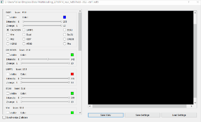

# Multilabelling_HDF5_View

## Author

Volker Hilsenstein

Developed at the EMBL Advanced Light Microscopy Facility

## About
This is an interactive viewer for multilabelling images in HDF5 format. This is a specific structure in an hdf5-container developed for our multilabelling acquisition (Publication forthcoming), a protocol for automated stainging, imaging and bleaching on a microscope stage, allowing highly multiplexed imaging at confocal resolution.

## Installation

The software currently requires PyQt4 and  Python 2.7.
A conda `.yml` file is in the repository.
A port to PyQt5 and Python 3.6 is in progress.

## Sample HDF5 file 

A sample multilabelling file is available here:

https://www.dropbox.com/s/ygv4tsg0n936l7e/field--X02--ctrl1.hdf5?dl=0
