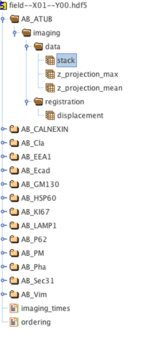
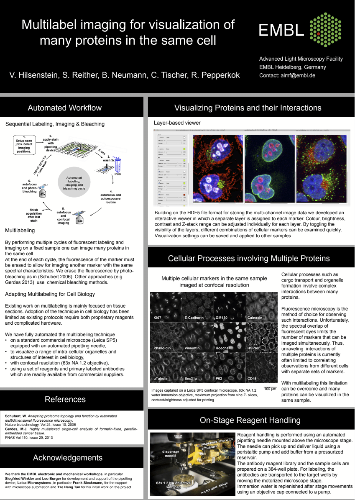

# Multilabelling_HDF5_View

## Author

Volker Hilsenstein

Developed at the EMBL Advanced Light Microscopy Facility

## About
This is an interactive viewer for multilabelling images in HDF5 format. This is a specific structure in an hdf5-container developed for Multilabelling acquisition (a project at the EMBL advanced light microscopy facility, Publication forthcoming), a protocol for automated immunofluorescence labeling, imaging and bleaching on a microscope, allowing highly multiplexed imaging at confocal resolution.

## Features

* One layer per antibody channels, toggle visibility of each layer. Unlimited number of channels.
* Quickly adjust colormap as well as contrast/brightness for each channel
* Displays maximum Z-projections through a stack
* Z-range sliders can be set individually per channel or operate in synchronized mode
* Support for alignment of translated views

## Installation

The software currently requires PyQt4 and  Python 2.7.
A conda `.yml` file is in the repository.
A port to PyQt5 and Python 3.6 is in progress (what has been holding me back with the porting is the lack of a suitable range slider widget in PyQt5).

## Sample HDF5 file 

A sample multilabelling file is available here:

https://www.dropbox.com/s/ygv4tsg0n936l7e/field--X02--ctrl1.hdf5?dl=0

## Usage

Activate your conda environment and start the viewer as `python ML_viewer.py`.
Drag the example image onto the dropzone dialog.

### Keyboard shortcuts

* `+` zoom in
* `-` zoom out
* `=` set default scale

## HDF5 file structure

The following screenshot from HDF5View shows the structure of the HDF5 files used
for the Multilabelling Viewer

This is not an exact specification (look in the sample file) but should be a starting point if you want to create a suitable HDF5 file from your own multiplexed images:

* **Image data**: The data for each antibody channel has a folder starting with `AB_` followed by the name of the antibody.
There is a subfolder `data` which contains the dataset `stack`, which is a 4D volume (z, ch, y, x). The viewer
expexts 2 channels to be present, one is the DAPI (nucleus channel) and the other is the channel for the 
respetive antibody. There are also pre-computed Z-projections in the structure but they are not required for this viewer.
* **registration data**: the `["displacement/registration"]` dataset contains the translation in x and  y of this data set. This is registration is applied on the fly in the viewer. This feature is implemented as during acquisition of the multiplexed images for which this viewer was developed the sample may shift slightly and the repositioning accuracy of the microscope stage is not perfect. If you want to use the viewer for perfectly registered images you can just put `0, 0` in here.
* **ordering** used for ordering the antibodies

## Citation and usage

Feel free to use MLHDF5Viewer in your resarch but please cite the work if you do. 

* To date there is no journal publication to cite (yet). However, the software has been presented as part of a [conference poster and lightning talks at VIZBI 2016](http://vizbi.org/Posters/2016/D10): **Multilabel imaging for visualization of many proteins in the same cell.** _Volker Hilsenstein, Sabine Reither, Beate Neumann, Christian Tischer, Rainer Pepperkok (EMBL Advanced Light Microscopy Facility, Heidelberg, Germany)_, Visualizing Biological Data (VIZBI), Mar 9-11 2016, Heidelberg, Germany. 
* This Github repo is archived at [Zenodo with a doi](https://zenodo.org/badge/latestdoi/153704601).

## Poster

The VIZBI 2016 Poster is reproduced below:

